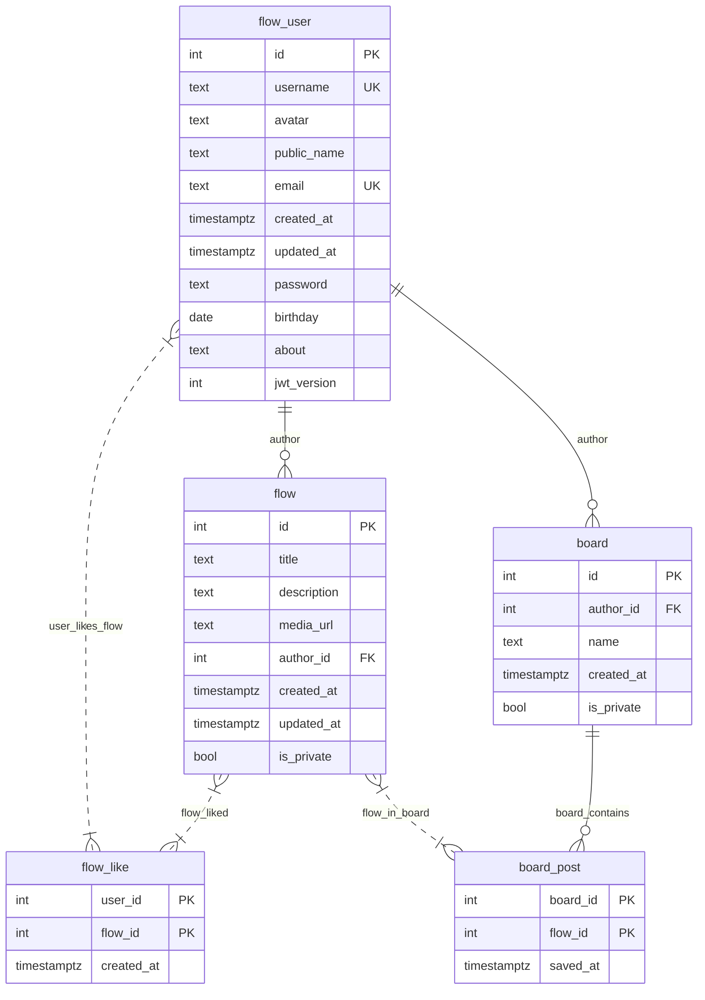

#### Таблица `flow_user`
**Описание:** Хранит информацию о пользователях, включая учетные данные и профильные данные.

**Первичный ключ:**  
`{id}`

**Альтернативные ключи:**  
`{email}`, `{username}`

**Функциональные зависимости:**
```
{id} -> username, avatar, public_name, email, created_at, updated_at, password, birthday, about, jwt_version
{email} -> id, username, avatar, public_name, created_at, updated_at, password, birthday, about, jwt_version
{username} -> id, email, avatar, public_name, created_at, updated_at, password, birthday, about, jwt_version
```

#### Таблица `flow`
**Описание:** Хранит информацию о "потоках" (пинах), созданных пользователями.

**Первичный ключ:**  
`{id}`

**Функциональные зависимости:**
```
{id} -> title, description, author_id, created_at, updated_at, is_private, media_url
```


#### Таблица `flow_like`
**Описание:** Связывает пользователей и flow, которые они лайкнули.

**Первичный ключ (составной):**  
`{user_id, flow_id}`

**Функциональные зависимости:**
```
{user_id, flow_id} -> created_at
```

---

#### Таблица `board`
**Описание:** Хранит информацию о "досках" (коллекциях потоков), созданных пользователями.

**Первичный ключ:**  
`{id}`

**Функциональные зависимости:**
```
{id} -> author_id, name, created_at, is_private
```

---

#### Таблица `board_post`
**Описание:** Связывает доски с потоками, добавленными в них.

**Первичный ключ (составной):**  
`{board_id, flow_id}`

**Функциональные зависимости:**
```
{board_id, flow_id} -> saved_at
```

### Соответствие нормальным формам

#### 1. Первая нормальная форма (1НФ)
- **Все таблицы:**
  - Атрибуты атомарны (отсутствуют вложенные структуры).
  - Первичные ключи явно определены:
    - `flow_user.id`, `flow.id`, `board.id` — простые ключи.
    - `flow_like.(user_id, flow_id)`, `board_post.(board_id, flow_id)` — составные ключи.

#### 2. Вторая нормальная форма (2НФ)
- **flow_user**:
  - Первичный ключ `{id}` — простой (не составной).
  - Все неключевые атрибуты (`username`, `email`, `password`, и т.д.) зависят от всего ключа `{id}`. Частичных зависимостей нет.
  - Альтернативные ключи (`email`, `username`) также являются ключами, но не участвуют в первичном ключе.

- **flow**, **board**:
  - Первичный ключ `{id}` — простой.
  - Все неключевые атрибуты зависят от `{id}`.

- **flow_like**, **board_post**:
  - Первичные ключи составные (`{user_id, flow_id}`, `{board_id, flow_id}`).
  - Единственный неключевой атрибут (`created_at`, `saved_at`) зависит от всего составного ключа.

---

#### 3. Третья нормальная форма (3НФ)
- **flow_user**:
  - Нет транзитивных зависимостей. Все неключевые атрибуты зависят только от первичного ключа `{id}`.
  - Альтернативные ключи (`email`, `username`) — но они не создают транзитивных зависимостей, так как:
    - `{email} -> {id}` и `{id} -> остальные атрибуты` не образуют цепочку (транзитивность нарушается из-за уникальности `email`).

- **flow**, **board**:
  - Нет транзитивных зависимостей. Все атрибуты зависят напрямую от первичного ключа `{id}`.

- **flow_like**, **board_post**:
  - Нет неключевых атрибутов, кроме `created_at`/`saved_at`, которые зависят от составного ключа.

#### 4. Нормальная форма Бойса-Кодда (НФБК)
- **flow_user**:
  - Все детерминанты (`{id}`, `{email}`, `{username}`) являются ключами:
    - `{id}` — первичный ключ.
    - `{email}`, `{username}` — уникальные альтернативные ключи.
  - Нет зависимостей, где детерминант не является ключом.

- **flow**, **board**:
  - Единственный детерминант — первичный ключ `{id}`.

- **flow_like**, **board_post**:
  - Детерминант — составной первичный ключ (`{user_id, flow_id}`, `{board_id, flow_id}`).

### ER-диаграмма

