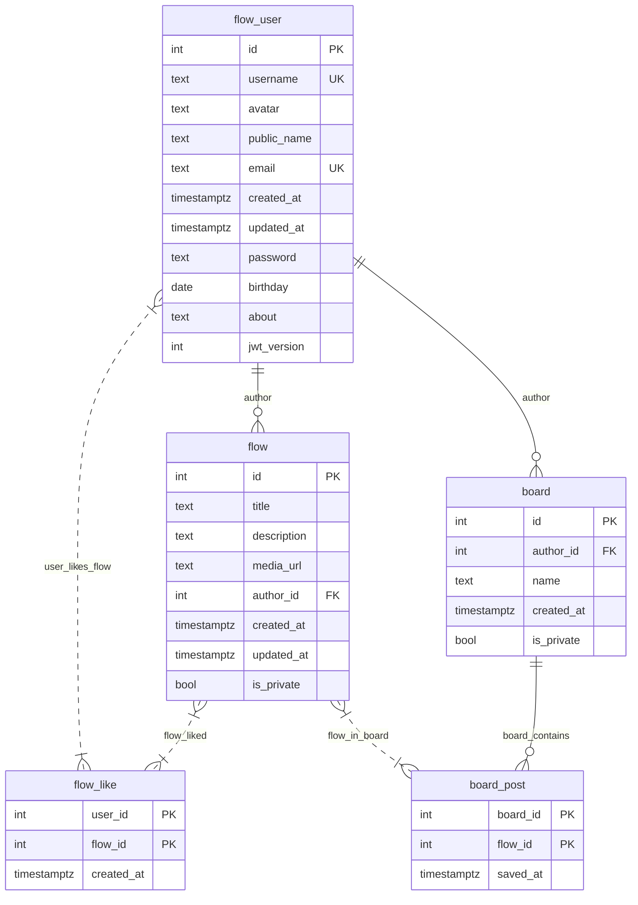

#### Таблица flow_user
**Описание:**<br>Хранит информацию о пользователях, включая учетные данные и профильные данные.

**Функциональные зависимости:**
```
{id} → username, avatar, public_name, email, created_at, updated_at, password, birthday, about, jwt_version
{email} → id, username, avatar, public_name, created_at, updated_at, password, birthday, about, jwt_version
{username} → id, email, avatar, public_name, created_at, updated_at, password, birthday, about, jwt_version
```

#### Таблица flow
**Описание:** <br>Хранит информацию о "потоках" (пинах) (flow), созданных пользователями.

**Функциональные зависимости:**
```
{id} → title, description, author_id, created_at, updated_at, is_private, media_url
```

#### Таблица flow_like
**Описание:** <br>Связывает пользователей и "потоки", которые они лайкнули.  
**Функциональные зависимости:**
```
{user_id, flow_id} → created_at
```

---

#### Таблица board
**Описание:** <br>Хранит информацию о "досках" (коллекциях потоков), созданных пользователями.  
**Функциональные зависимости:**
```
{id} → author_id, name, created_at, is_private
```

#### Таблица board_post
**Описание:** Связывает доски (`board`) с потоками (`flow`), которые добавлены в них.  
**Функциональные зависимости:**
```
{board_id, flow_id} → saved_at
```

### Соответствие нормальным формам

#### 1. Первая нормальная форма (1НФ)
- **flow_user** и **flow**:
  - Все атрибуты атомарны (отсутствуют массивы или вложенные структуры).
  - Каждая таблица имеет первичный ключ (`id`).

#### 2. Вторая нормальная форма (2НФ)
- **flow_user**:
  - Все неключевые атрибуты (например, `username`, `email`, `password`) полностью зависят от первичного ключа `id`. Нет частичных зависимостей от части составного ключа (ключ простой).
- **flow**:
  - Все атрибуты (например, `title`, `author_id`, `media_url`) зависят от первичного ключа `id`. Частичных зависимостей нет.

#### 3. Третья нормальная форма (3НФ)
- **flow_user**:
  - Нет транзитивных зависимостей. Все атрибуты зависят непосредственно от первичного ключа `id`.
  - Уникальные индексы на `email` и `username` не создают транзитивных зависимостей, так как они сами являются суперключами.
- **flow**:
  - Все атрибуты зависят от первичного ключа `id`. Транзитивных зависимостей нет.

#### 4. Нормальная форма Бойса-Кодда (НФБК)
- **flow_user**:
  - Все детерминанты (`id`, `email`, `username`) являются суперключами.
  - Например, `email` уникален и определяет все остальные атрибуты, что допустимо в НФБК.
- **flow**:
  - Единственный детерминант — `id` (первичный ключ). Нет зависимостей от не-ключевых атрибутов.

#### 5. Таблица `flow_like`
- **1НФ:**  
  Все атрибуты атомарны, первичный ключ `{user_id, flow_id}` существует.  
- **2НФ:**  
  `created_at` зависит от всего составного ключа `{user_id, flow_id}`.  
- **3НФ:**  
  Нет транзитивных зависимостей (все атрибуты зависят от ключа).  
- **НФБК:**  
  Единственный детерминант — `{user_id, flow_id}` (первичный ключ).  

#### 6. Таблица `board`
- **1НФ:**  
  Атрибуты атомарны, первичный ключ `{id}`.  
- **2НФ:**  
  Все неключевые атрибуты (`author_id`, `name`, `created_at`, `is_private`) зависят от `id`.  
- **3НФ:**  
  Нет транзитивных зависимостей (все зависит от `id`).  
- **НФБК:**  
  Детерминант `{id}` является суперключом.  

#### 7. Таблица `board_post`
- **1НФ:**  
  Атрибуты атомарны, первичный ключ `{board_id, flow_id}`.  
- **2НФ:**  
  `saved_at` зависит от всего составного ключа `{board_id, flow_id}`.  
- **3НФ:**  
  Нет транзитивных зависимостей.  
- **НФБК:**  
  Детерминант `{board_id, flow_id}` — суперключ.  

### ER-диаграмма

